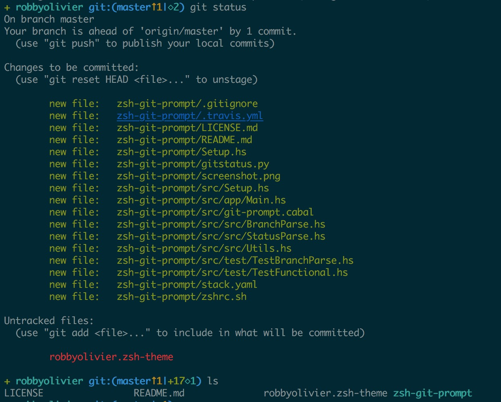

**robbyolivier** is a theme for iTerm and works on the oh-my-zsh. I borrow the ideas from the the [robbyrussell](https://github.com/robbyrussell/oh-my-zsh/blob/master/themes/robbyrussell.zsh-theme) theme and the project [zsh-git-prompt](https://github.com/olivierverdier/zsh-git-prompt) and I combine their authors'names to name this theme robbyolivier.

### Install

Step1. Install oh-my-zsh.

Step2. Copy the *robbyolivier.zsh-theme* file and the *zsh-git-prompt* folder to `~/.oh-my-zsh/custom/themes`, and keep them at a same level.

Step3. (Optional) Choose a color preset in iTerm. I'm using the [solarized](https://github.com/altercation/solarized/tree/master/iterm2-colors-solarized).

Step4. Open a window and good luck.

###Others

 If you want change the path where to put these files, you may edit the first line of *robbyolivier.zsh-theme* file

``` sh
source ~/.oh-my-zsh/custom/themes/zsh-git-prompt/zshrc.sh
```


The [print256colours.sh](https://gist.github.com/HaleTom/89ffe32783f89f403bba96bd7bcd1263) can print a 256-colour test pattern in the terminal. It really help me to choose what color to use in robbyolivier.

### License

This Project is released under the [MIT licenese](LICENSE).